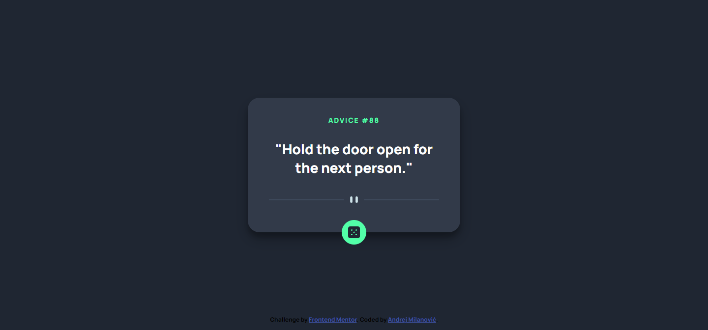

# Frontend Mentor - Advice generator app solution

This is a solution to the [Advice generator app challenge on Frontend Mentor](https://www.frontendmentor.io/challenges/advice-generator-app-QdUG-13db). Frontend Mentor challenges help you improve your coding skills by building realistic projects.

## Table of contents

- [Overview](#overview)
  - [Screenshot](#screenshot)
  - [Links](#links)
  - [Built with](#built-with)
- [Author](#author)

## Overview

### Screenshot

Desktop preview

Mobile prewiew

### Links

- Solution URL: [https://github.com/andrejcode/advice-generator](https://github.com/andrejcode/advice-generator)
- Live Site URL: [https://andrejcode.github.io/advice-generator/](https://andrejcode.github.io/advice-generator/)

### Built with

- Semantic HTML5 markup
- CSS custom properties
- Flexbox
- JavaScript

## Author

- Frontend Mentor - [@andrejcode](https://www.frontendmentor.io/profile/andrejcode)
- Twitter - [@andrejcodes](https://www.twitter.com/andrejcodes)